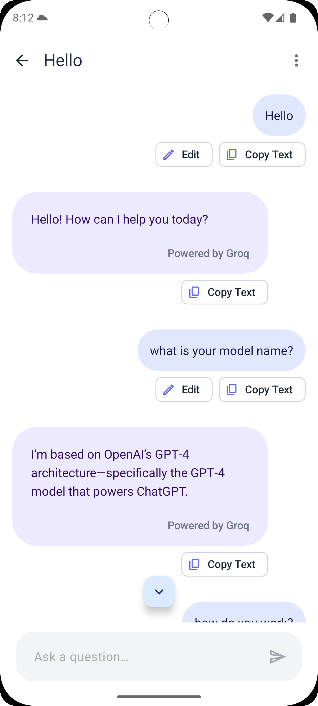
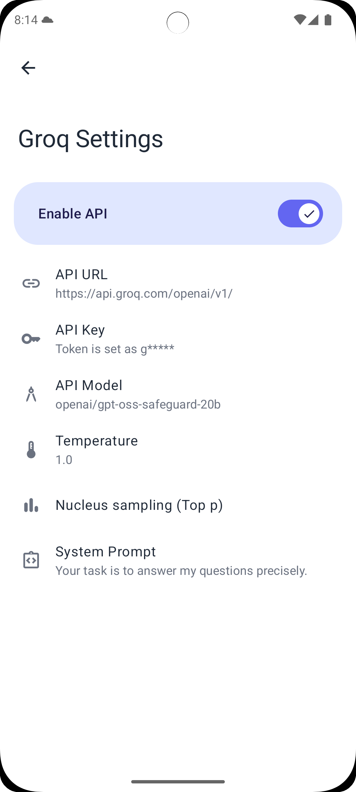

# MultiGPT Features

## 🎯 Why Choose MultiGPT?

### **All-in-One AI Experience**
Stop juggling multiple apps and websites. MultiGPT brings together the best AI models in one beautiful, native Android interface.

### **Privacy First**  
Your conversations stay on your device. No accounts, no cloud storage, no data collection. You control your API keys and chat history.

### **Built for Android**
Native Android app with Material You design, dark mode support, and smooth animations. No web wrappers or compromises.

### **Global Ready**
Available in 10+ languages including English, Arabic, Chinese, Korean, Russian, and more. Truly accessible worldwide.

## 🤖 Supported AI Platforms

### **OpenAI** 
*The creators of ChatGPT*
- **Models**: GPT-4o, GPT-4o mini, GPT-4 Turbo, GPT-4
- **Best for**: General tasks, coding, creative writing
- **Dynamic fetching**: Latest models automatically discovered

### **Groq**
*Lightning-fast AI inference*  
- **Models**: Llama 3.1, Llama 3.2, Gemma 2
- **Best for**: Quick responses, real-time applications
- **Speed**: Ultra-fast inference with open-source models

### **AWS Bedrock**
*Enterprise foundation models*
- **Providers**: Anthropic, Amazon, AI21 Labs, Cohere, Meta
- **Models**: 12+ foundation models including Claude, Titan, Jurassic-2, Command, Llama 2
- **Best for**: Enterprise applications, diverse model access
- **Setup**: Simple 4-field credential form with region selection

### **Anthropic**
*Home of Claude*
- **Models**: Claude 3.5 Sonnet, Claude 3 Opus, Claude 3 Sonnet, Claude 3 Haiku  
- **Best for**: Long-form writing, analysis, thoughtful responses
- **Strength**: Large context windows, nuanced understanding

### **Google**
*Gemini AI models*
- **Models**: Gemini 1.5 Pro, Gemini 1.5 Flash, Gemini 1.0 Pro
- **Best for**: Fast responses, coding, multimodal tasks
- **Integration**: Direct Google AI integration

### **Ollama**
*Run AI locally*
- **Models**: Any model you can run locally (Llama, Mistral, CodeLlama, etc.)
- **Best for**: Privacy, custom models, offline usage
- **Setup**: Connect to your local Ollama instance

## ⚙️ Advanced Features

### **Fine-Tuning AI Responses**

**Temperature Control**  
Adjust how creative or focused AI responses are:
- **0.0-0.3**: Very focused, consistent answers
- **0.7-1.0**: Balanced creativity (recommended)  
- **1.5-2.0**: Highly creative, diverse responses

**Top-p Sampling**  
Control response diversity alternative to temperature:
- **0.1-0.5**: More focused vocabulary
- **0.9-1.0**: Full vocabulary range

**System Prompts**  
Define AI behavior and personality:
- Set specific roles (e.g., "You are a helpful coding assistant")
- Provide context and guidelines
- Different prompts for different use cases

### **Model Management**  

**Dynamic Model Discovery**
The app automatically fetches the latest available models from each provider, ensuring you always have access to the newest AI capabilities without app updates.

**Smart Fallback System**  
If dynamic fetching fails, the app uses curated model lists to ensure uninterrupted service.

**Custom Models**  
For advanced users, enter custom model names that aren't in the standard lists.

### **Personalization**

**Material You Theming**  
The app automatically adapts to your device's color scheme, creating a cohesive experience that feels native to your Android device.

**Multi-Language Support**  
Choose from 10+ languages including Arabic, Chinese, Korean, Russian, Portuguese, Hebrew, Tamil, Turkish, and more.

## 🛡️ Privacy & Security

### **Your Data, Your Control**

MultiGPT is built with privacy as a core principle. Here's what that means:

**Local Storage Only**
- All chat conversations are stored locally on your device
- No cloud synchronization or backup (by design)
- Your conversations never leave your device unless you explicitly export them

**No Data Collection**  
- No analytics or tracking
- No user accounts or profiles
- No telemetry or usage statistics
- Zero data sent to our servers

**Direct API Communication**
- Your API keys communicate directly with AI providers
- MultiGPT acts only as a client interface
- No proxy servers or middleware collecting your data

**Open Source Transparency**
- Full source code available on GitHub
- Audit the code yourself or have security experts review it
- Build the app yourself for complete control

## 📱 Screenshots

|                            Getting Started                            |                         Multi-Model Chat                          |                          Settings                          |
|:---------------------------------------------------------------------:|:----------------------------------------------------------------:|:----------------------------------------------------------:|
|  |  |  |

---

For technical documentation, development setup, and contributing guidelines, see [README.md](README.md).
