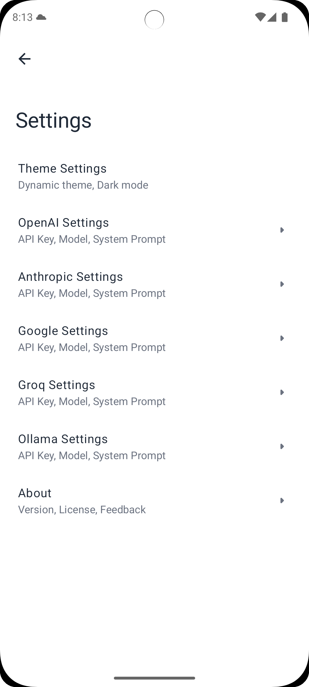
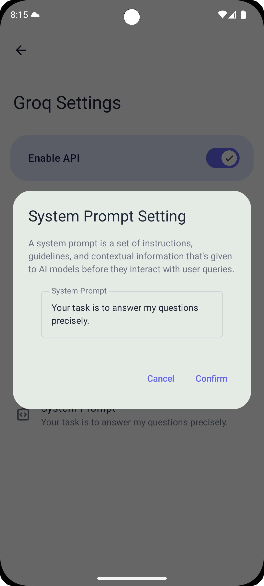

<div align="center">

# MultiGPT

**A powerful Android chat client for multiple AI models**

<p>
  
  
  
  
</p>

</div>

## 📱 Overview

MultiGPT brings the power of multiple AI models to your Android device. Chat with OpenAI, Anthropic, Google, and more—all from a single, privacy-focused interface built with modern Android development practices.

**Why MultiGPT?**
- 🚀 Access multiple AI models without switching apps
- 🔒 Complete privacy - all data stays on your device
- ⚡ Fast and responsive native Android experience
- 🎨 Beautiful Material You design with dynamic theming
- 🔧 Advanced configuration options for power users

## 📸 Screenshots

<div align="center">

|                            Getting Started                            |                         Multi-Model Settings                          |                          Individual Settings                          |
|:---------------------------------------------------------------------:|:---------------------------------------------------------------------:|:---------------------------------------------------------------------:|
|  |  |  |
|                      **Dynamic Model Selection**                      |                           **System Prompt**                           |                            **Chat Screen**                            |
|  |  |  |
</div>

## ✨ Key Features

### 🤖 Multi-Model Support
Connect to multiple AI platforms simultaneously using official APIs:

| Provider | Models | Features |
|----------|--------|----------|
| **OpenAI** | GPT-4, GPT-4o, GPT-3.5-turbo | Industry-leading language models |
| **Anthropic** | Claude 3.5 Sonnet, Claude 3 Opus, Haiku | Long context, thoughtful responses |
| **Google** | Gemini 1.5 Pro, Gemini 1.5 Flash | Fast, versatile AI models |
| **Groq** | Llama 3.1, Gemma 2 | Ultra-fast inference |
| **Ollama** | Any local model | Run AI models locally on your network |
| **Custom** | Any OpenAI-compatible API | Support for custom endpoints |

#### 🔄 Dynamic Model Discovery
- **Automatic Updates**: Fetch the latest available models from each provider
- **Real-time Sync**: Always have access to newly released models
- **Smart Fallback**: Seamlessly falls back to curated lists if API is unavailable
- **Zero Configuration**: Works automatically in setup and settings

### ⚙️ Advanced Configuration
Fine-tune your AI interactions with granular control:

- **Temperature Control** (0.0-2.0): Adjust response randomness
  - Low (0.0-0.5): Focused, deterministic responses
  - Medium (0.5-1.0): Balanced creativity and consistency
  - High (1.0-2.0): More creative and diverse outputs

- **Top-p / Nucleus Sampling** (0.1-1.0): Control response diversity
  - Use for alternative to temperature control
  - Fine-tune which tokens the model considers

- **Custom System Prompts**: Define AI behavior and personality
  - Set role and context for the AI
  - Maintain consistent behavior across conversations
  - Model-specific optimization

- **Per-Model Settings**: Different configurations for each provider
  - Save time with provider-specific defaults
  - Optimize for each model's strengths

### 🔐 Privacy First
Your data belongs to you:

- ✅ **Local Storage**: All chat history stored locally on your device
- ✅ **No Analytics**: Zero data collection or tracking
- ✅ **Direct Communication**: API calls go directly to providers
- ✅ **No Account Required**: Use your own API keys
- ✅ **Offline History**: Access past conversations without internet
- ✅ **Easy Export**: Export your conversations anytime

### 🎨 Modern Android Design
Built for the modern Android experience:

- **Material You**: Dynamic theming based on your wallpaper
- **Dark Mode**: Seamless dark mode support with OLED-friendly blacks
- **Adaptive Layout**: Optimized for phones and tablets
- **No Restarts**: Theme changes apply instantly without restarting
- **Per-App Language**: Choose your language (Android 13+)
- **Smooth Animations**: Fluid transitions throughout the app

### 🛠️ Technical Excellence
Built with industry best practices:

- **100% Kotlin**: Modern, concise, and safe
- **Jetpack Compose**: Declarative UI framework
- **Single Activity**: Modern navigation architecture
- **MVVM Pattern**: Clean separation of concerns
- **Kotlin Coroutines**: Efficient async operations
- **Ktor Client**: Powerful HTTP client for API calls
- **Room Database**: Robust local data persistence
- **Hilt Dependency Injection**: Scalable and testable architecture

## 🚀 Getting Started

### Prerequisites
- Android device or emulator running Android 8.0+ (API 26+)
- API keys from the providers you want to use:
  - [OpenAI API Key](https://platform.openai.com/account/api-keys)
  - [Anthropic API Key](https://console.anthropic.com/settings/keys)
  - [Google AI API Key](https://aistudio.google.com/app/apikey)
  - [Groq API Key](https://console.groq.com/keys)

### AdMob Configuration (Optional)
If you want to enable ads for monetization:
1. Create an [AdMob account](https://admob.google.com/)
2. Create an app and ad units in AdMob console
3. Create `app/src/main/res/values/ad_mob_config.xml` with your ad unit IDs:
   ```xml
   <?xml version="1.0" encoding="utf-8"?>
   <resources>
       <string name="admob_app_id">YOUR_ADMOB_APP_ID</string>
       <string name="home_banner">YOUR_BANNER_AD_UNIT_ID</string>
       <string name="setup_complete_interstitial">YOUR_INTERSTITIAL_AD_UNIT_ID</string>
       <string name="settings_banner">YOUR_SETTINGS_BANNER_AD_UNIT_ID</string>
       <string name="native_ad">YOUR_NATIVE_AD_UNIT_ID</string>
   </resources>
   ```
4. The file is already gitignored to keep your ad IDs secure

### Installation
1. Download the latest APK from [Releases](https://github.com/your-repo/releases)
2. Install the APK on your Android device
3. Open MultiGPT and follow the setup wizard
4. Enter your API keys and select models
5. Start chatting!

### First Time Setup
1. **Select Platforms**: Choose which AI providers you want to use
2. **Enter API Keys**: Securely store your API keys locally
3. **Choose Models**: Select default models (or let the app fetch available models)
4. **Configure Settings** (Optional): Adjust temperature, prompts, etc.
5. **Start Chatting**: Create your first conversation!

## 📖 Usage

### Creating a New Chat
1. Tap the **+** button on the home screen
2. Select which AI platforms to include
3. Start typing your message
4. The AI responses will appear in real-time

### Switching Models
1. Go to **Settings**
2. Select the platform (OpenAI, Anthropic, etc.)
3. Tap **Model Selection**
4. Choose from available models or enter a custom model name
5. Models are automatically fetched from the provider's API

### Adjusting Parameters
- **Temperature**: Settings → [Platform] → Temperature
- **Top-p**: Settings → [Platform] → Nucleus Sampling
- **System Prompt**: Settings → [Platform] → System Prompt

### Managing Conversations
- **View History**: All conversations saved automatically
- **Delete Chat**: Long press on a conversation
- **Export Chat**: Tap the export icon in conversation view

## 🗺️ Roadmap

### Coming Soon
- [ ] Image understanding (multimodal support)
- [ ] Voice input and output
- [ ] File attachments and analysis
- [ ] Conversation branching
- [ ] Advanced search and filtering
- [ ] Cloud backup (optional)
- [ ] Conversation sharing
- [ ] Widget support

### Under Consideration
- [ ] More AI platform integrations
- [ ] Collaborative conversations
- [ ] Plugin system for extensions
- [ ] Desktop companion app

Have a feature idea? [Open an issue](https://github.com/your-repo/issues) on GitHub!

## 🤝 Contributing

We welcome contributions from the community!

### Ways to Contribute
- 🐛 **Report Bugs**: Found a bug? [Create an issue](https://github.com/your-repo/issues)
- 💡 **Request Features**: Have an idea? Share it with us!
- 📝 **Improve Documentation**: Help others understand the project
- 🔧 **Submit Pull Requests**: Fix bugs or add features
- 🌍 **Translate**: Help localize the app to your language
- ⭐ **Star the Project**: Show your support!

### Development Setup
```bash
# Clone the repository
git clone https://github.com/your-repo/multigpt.git

# Open in Android Studio
# Build and run the app

# Run tests
./gradlew test
```

#### AdMob Development Setup
For development, test ads are configured by default. To set up your own AdMob ads:

1. **Create AdMob Configuration:**
   ```bash
   # Create the config file (it's gitignored by default)
   cp app/src/main/res/values/ad_mob_config.xml.example app/src/main/res/values/ad_mob_config.xml
   ```

2. **Configure Ad Unit IDs:**
   - Replace test IDs in `ad_mob_config.xml` with your AdMob ad unit IDs
   - Keep test IDs during development to avoid policy violations

3. **Ad Placements:**
   - **Home Banner**: Bottom-anchored adaptive banner on chat list
   - **Setup Interstitial**: Shows after completing initial setup
   - **Settings Banner**: Banner ads in settings screens (configurable)

4. **Testing:**
   - Use test ad unit IDs during development
   - Switch to production IDs only for release builds

### Code Style
- Follow [Kotlin coding conventions](https://kotlinlang.org/docs/coding-conventions.html)
- Use meaningful variable and function names
- Write clean, self-documenting code
- Add comments for complex logic

## 📄 License

This project is licensed under the terms specified in [LICENSE](./LICENSE).

## 🙏 Acknowledgments

- OpenAI, Anthropic, Google, and Groq for their powerful AI models
- The Android developer community for excellent tools and libraries
- All contributors who help make MultiGPT better

## 📞 Support

- 📧 **Email**: your-email@example.com
- 💬 **Discussions**: [GitHub Discussions](https://github.com/your-repo/discussions)
- 🐛 **Issues**: [GitHub Issues](https://github.com/your-repo/issues)

---

<div align="center">

**Made with ❤️**

[⬆ Back to Top](#multigpt)

</div>
