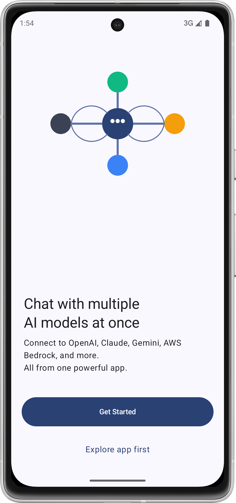
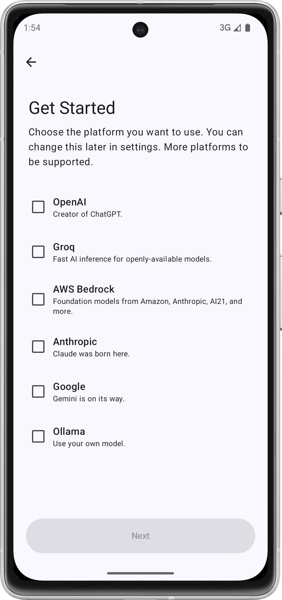
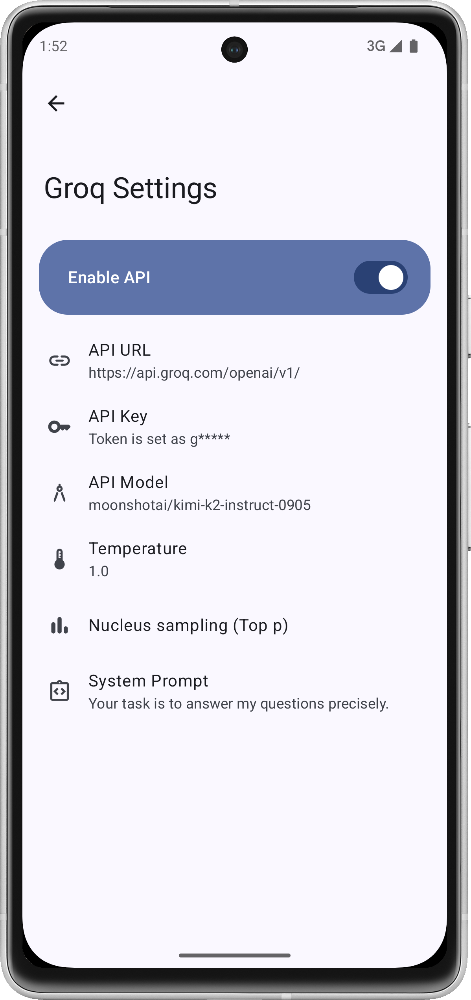
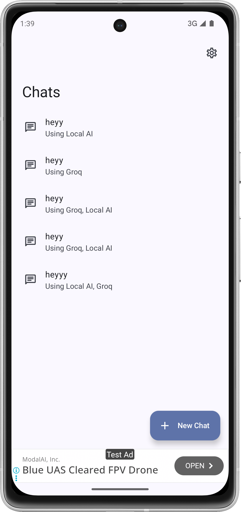
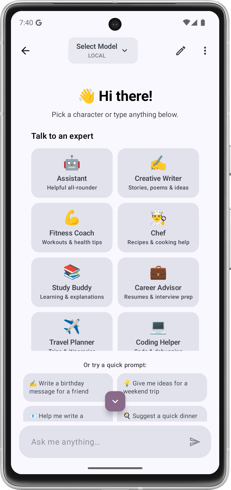
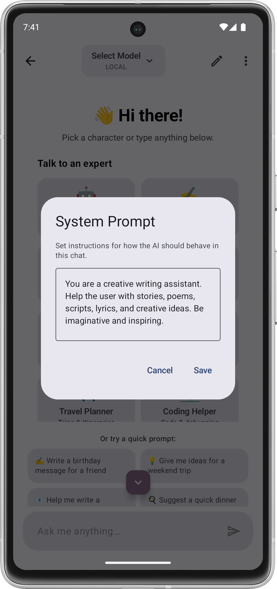
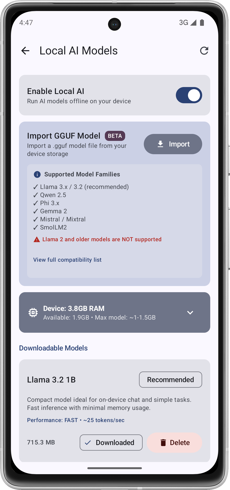
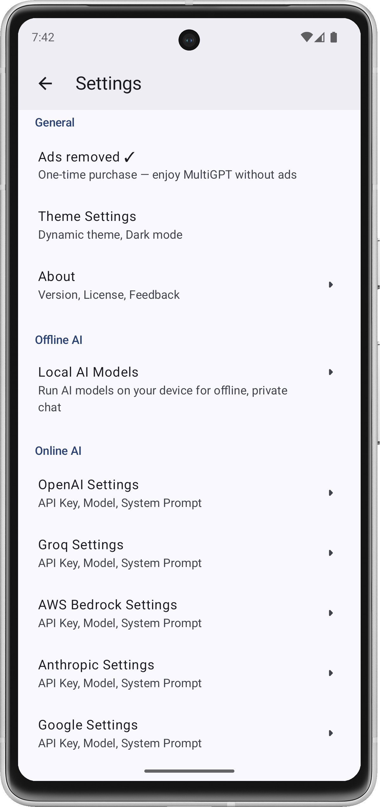

# MultiGPT

A native Android app for chatting with multiple AI models simultaneously.

[](https://android.com)
[](https://kotlinlang.org)
[](https://developer.android.com/jetpack/compose)
[](LICENSE)

<p>
  <a href="https://play.google.com/store/apps/details?id=com.matrix.multigpt">
    
  </a>
</p>

## Overview

MultiGPT allows users to communicate with multiple AI providers (OpenAI, Anthropic, Google, Groq, AWS Bedrock, Ollama) within a single conversation interface — plus **on-device local inference** powered by [llama-kotlin-android](https://github.com/it5prasoon/llama-kotlin-android). Built with modern Android development practices using Kotlin, Jetpack Compose, and MVVM architecture.

## 📱 Screenshots

<div align="center">

### App Introduction & Setup
|                                  Getting Started                                  |                                             Provider Selection                                              |                                            Provider Config                                            |
|:---------------------------------------------------------------------------------:|:-------------------------------------------------------------------------------------------------:|:------------------------------------------------------------------------------------------------:|
|  |  |  |

### Chat & Local Inference
|                                 Chat List                                 |                                   Chat with Agent                                   |                                  Chat Prompt                                   |
|:-------------------------------------------------------------------------------:|:---------------------------------------------------------------------------------:|:------------------------------------------------------------------------------:|
|  |  |  |

|                                  Local Provider                                   |                                  Settings                                   |
|:---------------------------------------------------------------------------------:|:------------------------------------------------------------------------------:|
|  |  |

</div>

## Technical Stack

### Architecture
- **Pattern**: MVVM with Clean Architecture
- **UI Framework**: Jetpack Compose with Material Design 3
- **Dependency Injection**: Hilt
- **Database**: Room with SQLite
- **Preferences**: DataStore
- **Networking**: Ktor HTTP client
- **Async**: Kotlin Coroutines and Flow

### Project Structure
```
app/src/main/kotlin/com/matrix/multigpt/
├── data/                 # Data layer
│   ├── database/         # Room database entities and DAOs
│   ├── datastore/        # DataStore preferences
│   ├── dto/              # Data transfer objects for APIs
│   ├── model/            # Domain models
│   ├── network/          # API client implementations
│   └── repository/       # Repository implementations
├── di/                   # Hilt dependency injection modules
├── presentation/         # UI layer
│   ├── common/           # Shared UI components
│   ├── theme/            # Material Design 3 theming
│   └── ui/               # Feature-specific UI screens
└── util/                 # Utility classes and extensions

localinference/src/main/kotlin/com/matrix/multigpt/localinference/
├── data/                 # Model catalog, downloads, storage
├── di/                   # Hilt module for local inference
├── presentation/         # Model selection UI
├── service/              # Inference engine & conversation summarizer
└── LocalInferenceProvider.kt  # Provider integration
```

## 🧠 Local Inference

MultiGPT supports **fully offline AI inference** directly on your Android device — no API keys, no internet, complete privacy.

### How it works

The `localinference` module uses [llama-kotlin-android](https://github.com/it5prasoon/llama-kotlin-android) to run GGUF models natively on-device via llama.cpp:

- **Browse & download models** from a curated catalog (fetched from Firebase)
- **Run inference locally** with streaming token generation
- **Conversation summarization** to manage context within device memory limits
- **No API key required** — works completely offline after model download

### Supported Local Models

| Model | Size | Best For |
|-------|------|----------|
| Phi-3.5-mini | ~2.4GB | General assistant |
| TinyLlama-1.1B | ~670MB | Low-end devices |
| Qwen2.5-1.5B | ~1GB | Coding, reasoning |
| Llama-3.2-3B | ~2GB | High quality chat |

### Requirements for Local Inference

- Android 12+ (API 31)
- 4GB+ RAM recommended
- arm64-v8a architecture

## Development Setup

### Prerequisites
- Android Studio Hedgehog (2023.1.1) or newer
- Android SDK 34+ (API level 34)
- Kotlin 1.9+
- JDK 17+

### Building the Project

1. **Clone the repository**
   ```bash
   git clone https://github.com/CodeShipping/Multi-GPT.git
   cd MultiGPT
   ```

2. **Open in Android Studio**
   - Import the project into Android Studio
   - Let Gradle sync complete

3. **Build and Run**
   ```bash
   ./gradlew assembleDebug
   ./gradlew installDebug
   ```

### Firebase Configuration (Optional)
If building from source, you can add your own `google-services.json` for Firebase integration:
1. Create a Firebase project at [Firebase Console](https://console.firebase.google.com/)
2. Download `google-services.json`
3. Place it in `app/` directory

### AdMob Configuration (Optional)
For ads, copy the example config and replace with your real IDs:
```bash
cp app/src/main/res/values/ad_mob_config.xml.example app/src/main/res/values/ad_mob_config.xml
```
Then edit `ad_mob_config.xml` with your AdMob unit IDs. The example file uses [Google's test IDs](https://developers.google.com/admob/android/test-ads) which are safe for development.

## API Integration

The app integrates with multiple AI providers through their REST APIs:

### Supported Providers
- **OpenAI**: GPT-4o, GPT-4o mini, GPT-4 Turbo, GPT-4
- **Anthropic**: Claude 3.5 Sonnet, Claude 3 Opus, Claude 3 Sonnet, Claude 3 Haiku
- **Google**: Gemini 1.5 Pro, Gemini 1.5 Flash, Gemini 1.0 Pro
- **Groq**: Llama 3.1, Llama 3.2, Gemma 2
- **AWS Bedrock**: Multiple foundation models from various providers
- **Ollama**: Local AI models via self-hosted API
- **Local Inference** 🆕: On-device models via [llama-kotlin-android](https://github.com/it5prasoon/llama-kotlin-android) — no internet required

### Dynamic Model Fetching
The app automatically discovers available models from each provider:
- Fetches current model lists via API
- Falls back to curated lists if fetching fails
- Supports custom model names for advanced users

### API Client Architecture
```kotlin
interface AIProviderAPI {
    @POST("v1/chat/completions")
    suspend fun createCompletion(
        @Body request: CompletionRequest
    ): CompletionResponse
}

// Implementation example
@Singleton
class OpenAIAPIImpl @Inject constructor(
    private val httpClient: HttpClient
) : OpenAIAPI {
    // API implementation
}
```

## Database Schema

### Entities
- **ChatRoom**: Conversation metadata and enabled AI providers
- **Message**: Individual messages with provider attribution

### Room Database
```kotlin
@Database(
    entities = [ChatRoom::class, Message::class],
    version = 1
)
abstract class ChatDatabase : RoomDatabase() {
    abstract fun chatRoomDao(): ChatRoomDao
    abstract fun messageDao(): MessageDao
}
```

## Security & Privacy

### Data Storage
- All conversations stored locally using Room database
- API keys encrypted using DataStore with encryption
- No data transmitted to external servers except AI providers

### API Key Management
```kotlin
// Secure storage implementation
class SettingDataSourceImpl @Inject constructor(
    private val dataStore: DataStore<Preferences>
) {
    suspend fun updateToken(apiType: ApiType, token: String) {
        dataStore.edit { preferences ->
            preferences[apiTokenMap[apiType]!!] = token
        }
    }
}
```

## Testing

### Running Tests
```bash
# Unit tests
./gradlew test

# Instrumented tests (requires device/emulator)
./gradlew connectedAndroidTest

# Test coverage
./gradlew jacocoTestReport
```

### Test Structure
```
app/src/test/kotlin/com/matrix/multigpt/
├── data/
│   └── repository/       # Repository tests
└── presentation/         # ViewModel tests
```

## CI/CD

The project uses GitHub Actions for continuous integration:
- **CodeQL Security Analysis**: Automated vulnerability scanning
- **Debug Builds**: APK generation for pull requests
- **Release Builds**: Signed APK/AAB generation
- **Code Quality**: Kotlin linting with ktlint

### Workflows
- `codeql.yml`: Security analysis
- `debug-build.yml`: Debug APK generation
- `release-build.yml`: Release builds with signing
- `ktlint.yml`: Code formatting checks

## Localization

The app supports multiple languages through Android's localization system:
- `values/strings.xml` - Default (English)
- `values-ar/strings.xml` - Arabic
- `values-zh-rCN/strings.xml` - Chinese (Simplified)
- `values-ko-rKR/strings.xml` - Korean
- And more...

## Contributing

Please read [CONTRIBUTING.md](CONTRIBUTING.md) for development guidelines and [CODE_OF_CONDUCT.md](CODE_OF_CONDUCT.md) for community standards.

### Development Workflow
1. Fork the repository
2. Create a feature branch: `git checkout -b feature/amazing-feature`
3. Commit changes: `git commit -m 'Add amazing feature'`
4. Push to branch: `git push origin feature/amazing-feature`
5. Open a pull request

### Code Style
- Follow [Kotlin Coding Conventions](https://kotlinlang.org/docs/coding-conventions.html)
- Use [ktlint](https://ktlint.github.io/) for formatting
- Write KDoc comments for public APIs
- Include unit tests for new features

## License

This project is licensed under the GNU General Public License v3.0 - see the [LICENSE](LICENSE) file for details.

### Attribution

This project is inspired by and builds upon concepts from [GPT Mobile](https://github.com/Taewan-P/gpt_mobile) by Taewan Park, which is also licensed under GPL-3.0. See [THIRD_PARTY_LICENSES.md](THIRD_PARTY_LICENSES.md) for complete attribution and license information.

## Support

- **Issues**: [GitHub Issues](https://github.com/CodeShipping/Multi-GPT/issues)
- **Discussions**: [GitHub Discussions](https://github.com/CodeShipping/Multi-GPT/discussions)
- **Email**: [support@codeshipping.org](mailto:support@codeshipping.org)

---

**Note**: This is an open source project. For user-facing documentation and app features, see [SUPPORT.md](SUPPORT.md).
